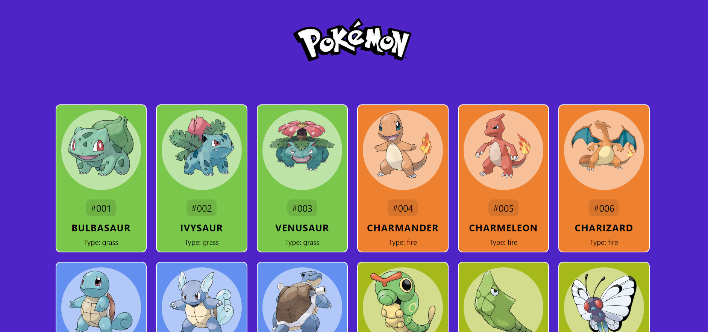

# 🕹️ Pokedex 
In the TV show Pokemon, the Pokedex keeps track of the Pokémon you’ve seen and caught, but here is an app which the user can view a list of Pokemons, search and view the details of a specific Pokemon.



The main goal of this project is to know how to fetch from an external api.

Each pokemon in the pokedex contain :

🔹 Her name

🔹 Her id number

🔹 Her type

## 👨‍💻 Technologies

👉 HTML

👉 CSS

👉 JavaScript

## Implementation Remarks

1️⃣ I have added to the program 4 main methodes that will help me perform the task in a simpler way:

1. getPokemon (id) - Recieves the Pokemon ID by pokeApi DB and sends a get request for the Pokemon with the entered id.
2. fetchPokemones (requiredNumOfPokemons) - Function to show the movies on the screen.
3. createPokemonCard (pokemon) - Receives a Pokemon object and displays it with its details on the screen.
4. getPokemonId (pokemon) -Receives a pokemon and Performs manipulations to print the Pokemon card with the correct ID in 3-digit format.

2️⃣ I added eventListener For the user to be able to load more pokemons by pressing a button.

## Database I used

🔹 pokeApi

## for any questions

```
if(haveAnyQuestions === true){
    let yourName = ".......", question = ".......";
    sendEmailToMe(yourName, question, odedatias8115@gmail.com);
}
```
